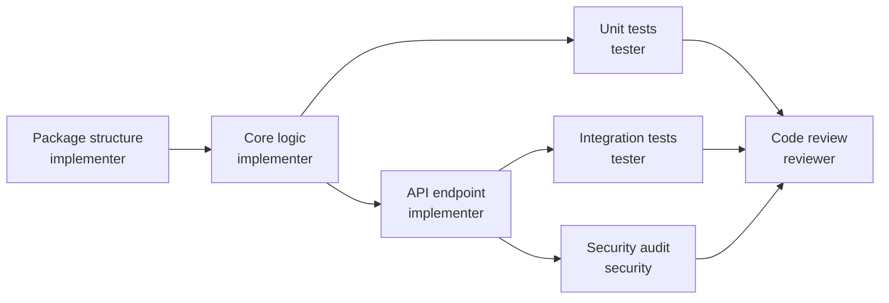

# Task Tracking with Beads

Use `bd` (beads) for task tracking. This is a git-native issue tracker designed for AI agents.

## Core Commands

| Command                               | Purpose                          |
| ------------------------------------- | -------------------------------- |
| `bd ready`                            | List tasks with no open blockers |
| `bd ready --json`                     | Get ready tasks as JSON          |
| `bd ready --assignee <role>`          | Filter by assignee role          |
| `bd create "Title" -t task`           | Create a new task                |
| `bd create "Title" -p 0`              | Create P0 (critical) task        |
| `bd create "Title" -p 1 --assignee X` | Create task assigned to role     |
| `bd update <id> --status in_progress` | Claim a task                     |
| `bd close <id> --reason "Done"`       | Complete a task                  |
| `bd dep add <child> <parent>`         | Add dependency (child waits)     |
| `bd show <id>`                        | View task details                |
| `bd list --parent <epic-id>`          | List tasks under an epic         |
| `bd sync`                             | Sync with git                    |

## Issue Types & Priority

- **Types:** `task`, `feature`, `bug`, `epic`, `chore`
- **Priority:** `P0` (critical) --> `P3` (low), default `P2`

## Description Templates

Use `bd create "Title" -d "description"` with these templates:

### Epic Template

```markdown
## Overview

Brief summary of the epic's goal and business value.

## Success Criteria

- [ ] Criterion 1
- [ ] Criterion 2

## Scope

**In Scope:** What's included
**Out of Scope:** What's explicitly excluded

## Dependencies

- External: APIs, services, teams
- Internal: Other epics or features
```

### Feature Template

```markdown
## Summary

One-line description of what this feature does.

## User Story

As a [role], I want [capability] so that [benefit].

## Acceptance Criteria

- [ ] Given X, when Y, then Z
- [ ] Given A, when B, then C

## Technical Notes

- Key implementation details
- Constraints or considerations

## Files

- src/module/\_feature.py
- tests/unit/test_feature.py
```

### Task Template (Implementation)

```markdown
## Objective

What this task accomplishes.

## Implementation Details

- Create/modify: src/path/file.py
- Add function: `function_name(params) -> ReturnType`
- Key logic: Brief description

## Acceptance Criteria

- [ ] Function implemented with type hints
- [ ] Docstring with examples
- [ ] Handles edge cases: X, Y, Z

## References

- Design doc: docs/proposals/feature.md
- Related: #parent-id
```

### Task Template (Testing)

```markdown
## Objective

Test coverage for [feature/function].

## Test Cases

- [ ] Happy path: valid input returns expected output
- [ ] Edge case: empty input
- [ ] Edge case: boundary values
- [ ] Error case: invalid input raises ValueError

## Files

- tests/unit/test_module.py
- tests/integration/test_feature.py

## Dependencies

- Blocked by: #impl-task-id
```

### Task Template (Security Audit)

```markdown
## Objective

Security review for [feature/module].

## Checklist

- [ ] Input validation (injection, XSS)
- [ ] Authentication/authorization
- [ ] Secrets handling (no hardcoded credentials)
- [ ] Error messages (no sensitive data leakage)
- [ ] Dependencies (known vulnerabilities)

## Files to Review

- src/path/file.py

## OWASP Reference

- Relevant OWASP Top 10 categories
```

### Bug Template

```markdown
## Summary

Brief description of the bug.

## Steps to Reproduce

1. Step one
2. Step two
3. Observe: actual behavior

## Expected Behavior

What should happen.

## Actual Behavior

What actually happens.

## Environment

- Python: 3.11
- OS: Linux/macOS/Windows

## Logs/Traceback

Paste relevant logs here
```

## Agent Assignees

| Assignee      | Role                      |
| ------------- | ------------------------- |
| `implementer` | Code implementation       |
| `tester`      | Unit/integration tests    |
| `reviewer`    | Code review               |
| `security`    | Security audit            |
| `infra`       | Infrastructure/deployment |
| `docs`        | Documentation             |

## Dependency Graph

Tasks should have proper blocking relationships:



**Rules:**

- Test tasks depend on their corresponding implementation tasks
- Review task depends on all implementation and test tasks
- Security audit depends on implementation (reviews code, not tests)

---

## Role-Specific Workflows

### Planner: Creating Tasks

After creating a design document, create tasks for all roles:

```bash
# Create an epic for the feature
bd create "Feature: user-auth" -t epic -p 1

# Implementation tasks
bd create "Create auth module" -t task -p 1 --assignee implementer --parent <epic-id>
bd create "Implement JWT validation" -t task -p 1 --assignee implementer --parent <epic-id>

# Test tasks (depend on implementation)
bd create "Unit tests for JWT" -t task -p 2 --assignee tester --parent <epic-id>
bd dep add <test-task-id> <impl-task-id>

# Review task (depends on tests)
bd create "Code review" -t task -p 2 --assignee reviewer --parent <epic-id>
bd dep add <review-task-id> <test-task-id>

# Security audit if needed
bd create "Security audit" -t task -p 1 --assignee security --parent <epic-id>
bd dep add <security-task-id> <impl-task-id>

bd sync
```

### Implementer: Working Tasks

```bash
bd ready --assignee implementer --json      # Find your tasks
bd update <id> --status in_progress         # Claim task
# ... do the work ...
bd close <id> --reason "Implemented in src/auth/_jwt.py"
bd sync
```

### Tester: Working Tasks

```bash
bd ready --assignee tester --json           # Find your tasks
bd update <id> --status in_progress         # Claim task
# ... write tests ...
bd close <id> --reason "Added tests in tests/unit/test_jwt.py"
bd sync
```

### Reviewer: Working Tasks

```bash
bd ready --assignee reviewer --json         # Find your tasks
bd update <id> --status in_progress         # Claim task
# ... review code ...
bd close <id> --reason "Approved with minor suggestions"
bd sync
```

### Security: Working Tasks

```bash
bd ready --assignee security --json         # Find your tasks
bd update <id> --status in_progress         # Claim task
# ... security audit ...
bd close <id> --reason "No critical findings, 2 recommendations"
bd sync
```

### Orchestrator: Routing Work

```bash
bd ready --json                             # Get all ready tasks
bd ready --assignee implementer --json      # Route to implementer
bd ready --assignee tester --json           # Route to tester
```

---

## When to Create Tasks for Each Role

| Role               | Create Tasks When Feature Involves      |
| ------------------ | --------------------------------------- |
| **Implementer**    | Always — code implementation            |
| **Tester**         | Always — unit tests, integration tests  |
| **Reviewer**       | Always — final code review              |
| **Security**       | Auth, secrets, user data, external APIs |
| **Infrastructure** | Cloud resources, IaC, deployment, CI/CD |
| **Docs**           | README updates, API docs, user guides   |

## Best Practices

1. Always run `bd ready` before starting work
2. Claim tasks with `bd update --status in_progress` before working
3. Close tasks immediately after completion with descriptive reason
4. Use `bd sync` after major changes
5. Create follow-up tasks when you discover additional work
6. Run `bd doctor` to check system health
