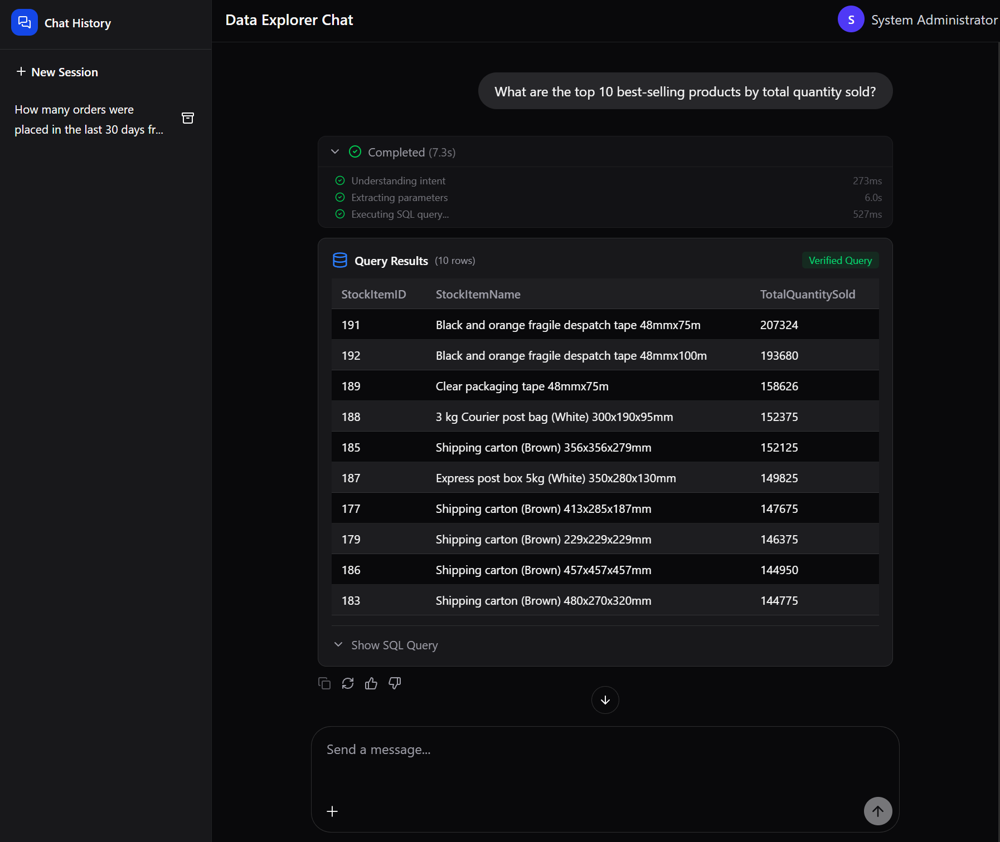

# Cadence

`cadence` is a reference application that demonstrates exploration of structured and unstructured data using natural language and agentic retrieval. It's built using [Microsoft Agent Framework](https://aka.ms/agent-framework) (MAF) hosted on FastAPI for intent and retrieval orchestration and [assistant-ui](https://github.com/assistant-ui/assistant-ui) for the user experience. Communication between these two components happens via Server-Sent Events with thread management delegated to Microsoft Foundry.

## Architecture Overview

### API Sequence Diagram

The following diagram shows the key API interactions between the frontend and backend:

```mermaid
%%{init: {'theme': 'dark'}}%%
sequenceDiagram
    participant Client as Frontend<br/>assistant-ui
    participant API as FastAPI
    participant MAF as Orchestration<br/>Agent Framework
    participant Foundry as Microsoft Foundry

    rect rgb(50, 40, 60)
        Note over Client, Foundry: Chat Interaction (SSE Stream)
        Client->>API: Send message<br/>(with access_token)
        API->>API: Validate token   
        API->>MAF: Execute workflow
        activate MAF           
        MAF->>Foundry: Create thread (if new)
        Foundry-->>MAF: Thread ID       
        MAF->>Foundry: Agent operations
        
        loop Real-time Updates
            MAF-->>Client: Step progress events
            MAF-->>Client: Tool execution results
            MAF-->>Client: Streamed content
        end
        
        MAF-->>Client: Thread ID + completion
        deactivate MAF         
    end

    rect rgb(30, 50, 70)
        Note over Client, Foundry: Thread Management
        Client->>API: List user threads
        API->>Foundry: Query threads by user_id
        Foundry-->>Client: Thread list with metadata
        
        Client->>API: Load thread history
        API->>Foundry: Fetch messages
        Foundry-->>Client: Conversation messages
        
        Client->>API: Update thread (title/status)
        Client->>API: Delete thread
        API-->>Client: Confirmation
    end
```

### Agent Workflow

The application uses a multi-agent workflow to process user queries:

```mermaid
%%{init: {'theme': 'dark'}}%%
flowchart TB
    subgraph Workflow["NL2SQL Workflow"]
        direction TB
        
        subgraph ChatAgent["Chat Agent"]
            CA_DESC["• Receives user messages<br/>• Triages requests<br/>• Renders final responses"]
        end
        
        subgraph DataAgent["Data Agent (NL2SQL)"]
            DA_DESC["• Match user intent to SQL template<br/>• Executes SQL queries<br/>• Returns structured results"]
            DA_TOOLS["Tools: search_templates, execute_sql"]
        end
        
        subgraph ParamExtractor["Parameter Extractor"]
            PE_DESC["• Extracts parameter values from user input<br/>• Fills SQL template tokens"]
        end
    end

    User([User Query]) --> ChatAgent
    ChatAgent -->|"Data question"| DataAgent
    DataAgent -->|"Template match found"| ParamExtractor
    ParamExtractor -->|"Extracted parameters"| DataAgent
    DataAgent -->|"Query results"| ChatAgent
    ChatAgent --> Response([Rendered Response])

    style Workflow fill:#1a1a2e,stroke:#4a4a6a
    style ChatAgent fill:#32284d,stroke:#6b5b95
    style DataAgent fill:#1e3246,stroke:#4a7c9b
    style ParamExtractor fill:#28473d,stroke:#5a9a7a

```

### Workflow Steps

| Agent | Purpose |
|-------|---------|
| **Chat Agent** | User-facing agent that receives messages, triages them (data vs. general questions), and renders the final response with helpful context |
| **Data Agent (NL2SQL)** | Searches for cached query templates matching user intent, executes SQL against the database, and returns structured results |
| **Parameter Extractor** | When a query template is matched, extracts parameter values from the user's natural language input to fill SQL template tokens |

## Getting Started

For complete setup instructions including Azure infrastructure deployment, local development, and production deployment, see the [Infrastructure Guide](infra/README.md).

### Quick Start

1. **Deploy Infrastructure** - Follow the [Infrastructure Guide](infra/README.md) to set up Azure resources
2. **Install Dependencies** - `pnpm install` (also sets up Python environment)
3. **Configure Environment** - Set up `.env` files for API and frontend
4. **Run Locally** - `pnpm dev` starts both UI and agent servers
