# Cadence Backend

FastAPI backend for the Cadence NL2SQL application, powered by [Microsoft Agent Framework (MAF)](https://github.com/microsoft/agent-framework).

## Architecture Overview

### API Sequence Diagram

The following diagram shows the key API interactions between the frontend and backend:

```mermaid
%%{init: {'theme': 'dark'}}%%
sequenceDiagram
    participant Client as Frontend<br/>assistant-ui
    participant API as FastAPI
    participant MAF as Orchestration<br/>Agent Framework
    participant Foundry as Microsoft Foundry

    rect rgb(50, 40, 60)
        Note over Client, Foundry: Chat Interaction (SSE Stream)
        Client->>API: Send message<br/>(with access_token)
        API->>API: Validate token
        API->>MAF: Execute workflow
        activate MAF
        MAF->>Foundry: Create thread (if new)
        Foundry-->>MAF: Thread ID
        MAF->>Foundry: Agent operations

        loop Real-time Updates
            MAF-->>Client: Step progress events
            MAF-->>Client: Tool execution results
            MAF-->>Client: Streamed content
        end

        MAF-->>Client: Thread ID + completion
        deactivate MAF
    end

    rect rgb(30, 50, 70)
        Note over Client, Foundry: Thread Management
        Client->>API: List user threads
        API->>Foundry: Query threads by user_id
        Foundry-->>Client: Thread list with metadata

        Client->>API: Load thread history
        API->>Foundry: Fetch messages
        Foundry-->>Client: Conversation messages

        Client->>API: Update thread (title/status)
        Client->>API: Delete thread
        API-->>Client: Confirmation
    end
```



### Agent Workflow

The application uses a multi-agent workflow to process user queries:

```mermaid
%%{init: {'theme': 'dark'}}%%
flowchart TB
    subgraph Workflow["NL2SQL Workflow"]
        direction TB

        subgraph ChatAgent["Chat Agent"]
            CA_DESC["• Receives user messages<br/>• Triages requests<br/>• Renders final responses"]
        end

        subgraph DataAgent["Data Agent (NL2SQL)"]
            DA_DESC["• Match user intent to SQL template<br/>• Executes SQL queries<br/>• Returns structured results"]
            DA_TOOLS["Tools: search_templates, execute_sql"]
        end

        subgraph ParamExtractor["Parameter Extractor"]
            PE_DESC["• Extracts parameter values from user input<br/>• Fills SQL template tokens"]
        end
    end

    User([User Query]) --> ChatAgent
    ChatAgent -->|"Data question"| DataAgent
    DataAgent -->|"Template match found"| ParamExtractor
    ParamExtractor -->|"Extracted parameters"| DataAgent
    DataAgent -->|"Query results"| ChatAgent
    ChatAgent --> Response([Rendered Response])

    style Workflow fill:#1a1a2e,stroke:#4a4a6a
    style ChatAgent fill:#32284d,stroke:#6b5b95
    style DataAgent fill:#1e3246,stroke:#4a7c9b
    style ParamExtractor fill:#28473d,stroke:#5a9a7a

```



### Workflow Agents

| Agent | Purpose |
|-------|---------|
| **Chat Agent** | User-facing agent that receives messages, triages them (data vs. general questions), and renders the final response with helpful context |
| **Data Agent (NL2SQL)** | Searches for cached query templates matching user intent, executes SQL against the database, and returns structured results |
| **Parameter Extractor** | When a query template is matched, extracts parameter values from the user's natural language input to fill SQL template tokens |

### Agent Components

| Component | Path | Purpose |
|-----------|------|---------|
| **API Layer** | `api/` | FastAPI routes, middleware, SSE streaming |
| **ConversationOrchestrator** | `entities/orchestrator/` | Session management, intent classification, response rendering |
| **NL2SQLController** | `entities/nl2sql_controller/` | Query flow orchestration, template search, SQL execution |
| **ParameterExtractor** | `entities/parameter_extractor/` | Extracts parameter values from natural language to fill SQL template tokens |
| **ParameterValidator** | `entities/parameter_validator/` | Non-LLM validation of parameters (type, range, regex, allowed values) |
| **QueryBuilder** | `entities/query_builder/` | Dynamic SQL generation from table metadata when no template matches |
| **QueryValidator** | `entities/query_validator/` | SQL syntax validation, table allowlist, security checks |
| **Workflow** | `entities/workflow/` | MAF workflow definition connecting all agents |

### API Endpoints

| Route | Description |
|-------|-------------|
| `POST /chat` | SSE streaming chat endpoint |
| `GET /threads` | List conversation threads |
| `GET /threads/{id}` | Load thread history |
| `DELETE /threads/{id}` | Delete a thread |
| `GET /health` | Health check |

## Development

### Prerequisites

- Python 3.11+
- [uv](https://docs.astral.sh/uv/) package manager
- SQL Server with WideWorldImporters database
- Azure AI Search instance (for query templates)
- Azure AI Foundry project endpoint

### Setup

From the repository root:

```bash
./devsetup.sh          # One-command setup (installs uv, creates venv, installs deps)
cp src/backend/.env.example src/backend/.env  # Configure environment variables
```

### Running

```bash
uv run poe dev-api     # Start FastAPI dev server with hot reload
```

### Environment Variables

Copy `.env.example` to `.env` and configure:

| Variable | Required | Description |
|----------|----------|-------------|
| `AZURE_AI_PROJECT_ENDPOINT` | Yes | Foundry project endpoint |
| `AZURE_AI_MODEL_DEPLOYMENT_NAME` | Yes | Default model deployment |
| `AZURE_SEARCH_ENDPOINT` | Yes | AI Search endpoint for query templates |
| `AZURE_SQL_SERVER` | Yes | SQL Server hostname |
| `AZURE_SQL_DATABASE` | Yes | Database name |
| `APPLICATIONINSIGHTS_CONNECTION_STRING` | No | Application Insights for tracing |
| `ENABLE_INSTRUMENTATION` | No | Set `true` to enable OpenTelemetry |

### Quality Checks

```bash
uv run poe check       # Run all checks (lint + typecheck)
uv run poe test        # Run tests with coverage
uv run poe lint        # Ruff linting only
uv run poe format      # Format, lint, and typecheck
uv run poe typecheck   # basedpyright type checking
```

## Docker

The Dockerfile uses a multi-stage build:

1. **Builder stage**: Installs dependencies via `uv sync`
2. **Runtime stage**: Slim image with ODBC driver for SQL Server, application code only

```bash
docker build -f src/backend/Dockerfile -t cadence-backend .
docker run -p 8000:8000 --env-file src/backend/.env cadence-backend
```

Build context is the repository root.
